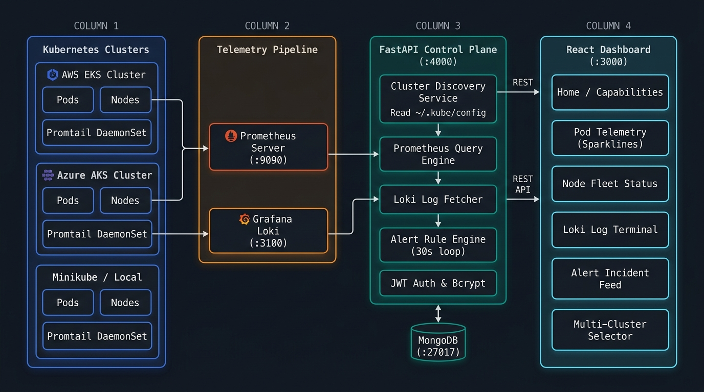
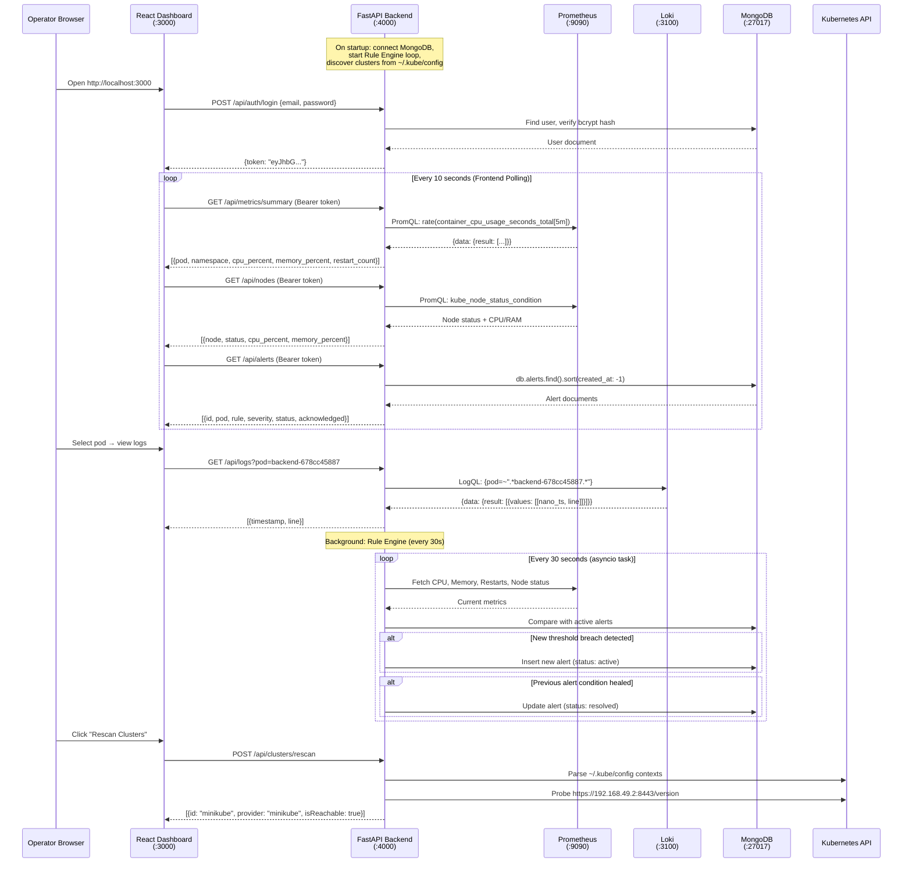

<div align="center">

# ⚡ Kubernetes Monitoring & Observability Control Plane

**A unified, real-time Kubernetes observability and multi-cluster incident response platform.**

[](https://fastapi.tiangolo.com)
[](https://react.dev)
[-326CE5?style=for-the-badge&logo=kubernetes&logoColor=white)](https://kubernetes.io)
[](https://prometheus.io)
[](https://grafana.com/oss/loki/)
[](LICENSE)

</div>

---

## 📑 Table of Contents
1. [Overview & Core Capabilities](#-overview--core-capabilities)
2. [System Architecture](#-system-architecture)
3. [Tech Stack](#-tech-stack)
4. [Deployment & Setup Guides](#-deployment--setup-guides)
   - [Option A: Quick Local Setup (Docker Compose)](#option-a-quick-local-setup-docker-compose)
   - [Option B: Local Kubernetes (Minikube + Helm)](#option-b-local-kubernetes-minikube--helm)
   - [Option C: AWS Cloud (Amazon EKS)](#option-c-aws-cloud-amazon-eks)
   - [Option D: Azure Cloud (Azure Kubernetes Service - AKS)](#option-d-azure-cloud-azure-kubernetes-service---aks)
5. [Operator Authentication & Console Access](#-operator-authentication--console-access)
6. [API Specification & Endpoints](#-api-specification--endpoints)
7. [Production Roadmap & Upcoming Features](#-production-roadmap--upcoming-features)
8. [Authors & Maintainers](#-authors--maintainers)
9. [License](#-license)

---

## 🌟 Overview & Core Capabilities

The **Kubernetes Monitoring & Observability Control Plane** is a developer- and SRE-centric observability dashboard engineered to monitor, diagnose, and troubleshoot distributed container workloads across hybrid and multi-cloud Kubernetes clusters.

### Key Capabilities:
- **⚡ Sub-Second Pod Telemetry**: Continuous 10-second Prometheus scraping across all namespaces. Displays CPU % and RAM % utilization with dynamic sparkline usage bars (`<30%` Sky Blue, `30-60%` Amber, `>60%` Rose Red).
- **📜 Distributed Loki Pod Log Streaming**: Direct integration with Grafana Loki and in-cluster Promtail daemonsets. Features automatic JSON container log decoding, color-coded level badges (`INFO`, `WARN`, `ERROR`), deduped timestamps, regex filtering, and line-wrapping toggles.
- **🌐 Multi-Cluster Kubeconfig Auto-Discovery**: Automatically parses all contexts defined in `$KUBECONFIG`, `~/.kube/config`, and `~/.kube/*.yaml`. Auto-detects **AWS EKS**, **Azure AKS**, **GCP GKE**, **Minikube**, and **Kind** with non-blocking connectivity probes and dynamic rescan.
- **🚨 Incident Alert Rule Engine**: Continuous background loop evaluating threshold breaches (CPU spikes, memory exhaustion, CrashLoopBackOff cycles, Node readiness failures). Features active vs. resolved styling and automatic collapsible incident grouping (`× 12 occurrences`).
- **🖥️ Node Fleet Diagnostics**: Real-time node readiness status (`Ready` / `NotReady`) and cluster hardware capacity saturation.
- **🔒 Zero-Trust Operator Authentication**: Secure JWT session management with Bcrypt password hashing, MongoDB audit trail, and compliance terms validation.

---

## 🏗️ System Architecture

<div align="center">



</div>

The platform is composed of **four distinct layers**, each running independently and communicating over well-defined interfaces:

### Layer 1 — Kubernetes Clusters (Data Source)

The monitored infrastructure. Supports **any number of clusters simultaneously** — Minikube on your laptop, production EKS on AWS, AKS on Azure, or GKE on GCP. Each cluster runs:

| Component | Role |
|---|---|
| **Workload Pods** | Your application containers across all namespaces |
| **Kubelet / Node Exporter** | Exposes node-level CPU, memory, disk, and network metrics |
| **Promtail DaemonSet** | Tails container `stdout`/`stderr` logs and pushes them to Loki |
| **kube-state-metrics** | Exposes pod restart counts, deployment status, and resource limits |

### Layer 2 — Telemetry Pipeline (Collection & Aggregation)

| Service | Port | Function |
|---|---|---|
| **Prometheus Server** | `:9090` | Scrapes `container_cpu_usage_seconds_total`, `container_memory_working_set_bytes`, `kube_pod_container_status_restarts_total`, and `kube_node_status_condition` at 15s intervals |
| **Grafana Loki** | `:3100` | Receives log streams from Promtail via `/loki/api/v1/push`, indexes by pod/namespace labels, queryable via LogQL |

### Layer 3 — FastAPI Control Plane (Backend `:4000`)

The async Python backend that acts as the unified API gateway between raw telemetry and the operator dashboard:

```
backend/app/
├── config.py                    ← Pydantic Settings (env vars, typed config)
├── main.py                      ← FastAPI app, CORS, Lifespan, router mounting
│
├── core/
│   ├── database.py              ← Async Motor client (MongoDB connection pool)
│   └── security.py              ← JWT creation/verification, Bcrypt hashing
│
├── services/
│   ├── cluster_discovery.py     ← Parses ~/.kube/config, $KUBECONFIG, ~/.kube/*.yaml
│   │                               Infers provider (EKS/AKS/GKE/Minikube/Kind)
│   │                               Non-blocking health probes with 2.5s timeout
│   │
│   ├── prometheus.py            ← Async httpx queries to Prometheus /api/v1/query
│   │                               Pod CPU %, RAM %, restart counts, node status
│   │                               15-minute range queries for sparkline history
│   │
│   ├── loki.py                  ← Async httpx queries to Loki /loki/api/v1/query_range
│   │                               Nanosecond→millisecond timestamp conversion
│   │
│   └── rule_engine.py           ← asyncio background loop (default: every 30s)
│                                   Evaluates: CPU >80/95%, Memory >85/95%,
│                                   CrashLoopBackOff (restart delta), Node NotReady
│                                   Creates/auto-resolves alerts in MongoDB
│
├── api/
│   ├── auth.py                  ← POST /api/auth/login, POST /api/auth/signup
│   ├── metrics.py               ← GET /api/metrics/summary, GET /api/metrics/history
│   ├── nodes.py                 ← GET /api/nodes
│   ├── logs.py                  ← GET /api/logs?pod=<name>
│   ├── alerts.py                ← GET /api/alerts, POST /api/alerts/:id/acknowledge
│   └── clusters.py              ← GET /api/clusters, POST /api/clusters/rescan
│
└── models/
    └── schemas.py               ← Pydantic response models (OpenAPI auto-docs)
```

| Service Module | Upstream Dependency | Background? |
|---|---|---|
| `cluster_discovery.py` | `~/.kube/config` filesystem + `httpx` health probes | On-demand |
| `prometheus.py` | Prometheus HTTP API (`:9090`) via `httpx` | On-demand per request |
| `loki.py` | Loki HTTP API (`:3100`) via `httpx` | On-demand per request |
| `rule_engine.py` | `prometheus.py` → MongoDB writes | **Yes** — `asyncio.create_task` loop |

### Layer 4 — React Operator Dashboard (Frontend `:3000`)

| View | Data Source | Key Visual Features |
|---|---|---|
| **Home** | All services | Capability cards, interactive simulator, architecture pipeline |
| **Overview** | Metrics + Alerts | Cluster-wide health summary, top-N pods, quick stats |
| **Pods** | `/api/metrics/summary` | Sparkline CPU/RAM bars (44px × 5px, severity-colored), tiered restart badges |
| **Nodes** | `/api/nodes` | Node readiness status, CPU/RAM saturation gauges |
| **Alerts** | `/api/alerts` | Active vs. resolved separation, grouped incident rows with `× N events` |
| **Logs** | `/api/logs` | Structured JSON parsing, color-coded level badges, deduped timestamps, wrap toggle |

### Data Flow (End-to-End Request Lifecycle)



---

## 🛠️ Tech Stack

| Layer | Technology | Purpose |
|---|---|---|
| **Frontend** | React 18 + TypeScript + Vite | SPA operator dashboard |
| **Styling** | Tailwind CSS + custom dark tokens | Cyber-aesthetic dark theme with JetBrains Mono |
| **Charts** | Recharts | 15-minute historical sparkline visualizations |
| **Icons** | Lucide React | Consistent iconography across all views |
| **Backend** | FastAPI (Python 3.10+) + Uvicorn | Async ASGI web framework with auto-generated OpenAPI docs |
| **Config** | Pydantic Settings | Typed environment variable parsing with `.env` support |
| **Database** | MongoDB via Motor (async) | Alert persistence, user accounts, audit trail |
| **HTTP Client** | httpx (async) | Non-blocking Prometheus and Loki queries |
| **K8s Client** | Official `kubernetes` Python SDK | Kubeconfig parsing and cluster context management |
| **Security** | PyJWT + Bcrypt | HMAC-SHA256 token issuance and password hashing |

---

## 🚀 Deployment & Setup Guides

### Option A: Quick Local Setup (Docker Compose)

Use this mode if you want to test the full stack on your local machine using standalone Docker containers for MongoDB, Prometheus, and Loki.

#### 1. Start Infrastructure Services
```bash
npm run infra:up
```
*(Spins up MongoDB on `:27017`, Prometheus on `:9090`, and Loki on `:3100`)*

#### 2. Start the Python FastAPI Backend
```bash
cd backend
python3 -m venv .venv
source .venv/bin/activate
pip install -r requirements.txt
uvicorn app.main:app --host 0.0.0.0 --port 4000 --reload
# Or from root workspace:
npm run backend:dev
```

#### 3. Start the Frontend UI
In a separate terminal:
```bash
npm run frontend:dev
```
- Open your browser at **`http://localhost:3000`**.

---

### Option B: Local Kubernetes (Minikube + Helm)

Use this mode to monitor real pods and logs running inside a local Minikube cluster.

#### 1. Start Minikube & Install Monitoring Stack
```bash
# 1. Start Minikube
minikube start --cpus=4 --memory=8192 --driver=docker

# 2. Add Helm repositories
helm repo add prometheus-community https://prometheus-community.github.io/helm-charts
helm repo add grafana https://grafana.github.io/helm-charts
helm repo update

# 3. Install Prometheus Operator & Kube-State-Metrics
helm install monitoring prometheus-community/kube-prometheus-stack \
  --namespace monitoring --create-namespace

# 4. Install Promtail to push live pod logs to Loki
helm install promtail grafana/promtail \
  --namespace monitoring \
  --set "config.clients[0].url=http://192.168.49.1:3100/loki/api/v1/push"
```

#### 2. Forward Prometheus to Port 9090
```bash
kubectl port-forward -n monitoring svc/monitoring-kube-prometheus-prometheus 9090:9090
```

#### 3. Start Backend & Frontend
```bash
npm run backend:dev
npm run frontend:dev
```

---

### Option C: AWS Cloud (Amazon EKS)

Deploy and monitor production clusters running in Amazon Web Services (AWS).

#### 1. Connect Local Kubeconfig to Amazon EKS
```bash
aws eks update-kubeconfig --region <aws-region> --name <your-eks-cluster-name>
```

#### 2. Deploy Prometheus Operator & Promtail in EKS
```bash
# Add Helm repositories
helm repo add prometheus-community https://prometheus-community.github.io/helm-charts
helm repo add grafana https://grafana.github.io/helm-charts
helm repo update

# Install kube-prometheus-stack
helm install monitoring prometheus-community/kube-prometheus-stack \
  --namespace monitoring --create-namespace

# Install Promtail (point to your Loki endpoint)
helm install promtail grafana/promtail \
  --namespace monitoring \
  --set "config.clients[0].url=http://<loki-internal-dns-or-ip>:3100/loki/api/v1/push"
```

#### 3. Forward Prometheus or Configure Ingress
```bash
kubectl port-forward -n monitoring svc/monitoring-kube-prometheus-prometheus 9090:9090
```
- The backend will **automatically auto-discover** the AWS EKS context and label it as `AWS EKS`.

---

### Option D: Azure Cloud (Azure Kubernetes Service - AKS)

Deploy and monitor production clusters running in Microsoft Azure.

#### 1. Connect Local Kubeconfig to Azure AKS
```bash
az aks get-credentials --resource-group <your-resource-group> --name <your-aks-cluster-name>
```

#### 2. Deploy Monitoring Stack on AKS
```bash
# Add Helm repositories
helm repo add prometheus-community https://prometheus-community.github.io/helm-charts
helm repo add grafana https://grafana.github.io/helm-charts
helm repo update

# Install kube-prometheus-stack
helm install monitoring prometheus-community/kube-prometheus-stack \
  --namespace monitoring --create-namespace

# Install Promtail
helm install promtail grafana/promtail \
  --namespace monitoring \
  --set "config.clients[0].url=http://<loki-internal-dns-or-ip>:3100/loki/api/v1/push"
```

#### 3. Forward Prometheus or Bind via Private Link
```bash
kubectl port-forward -n monitoring svc/monitoring-kube-prometheus-prometheus 9090:9090
```
- The backend will **automatically auto-discover** the AKS context and label it as `AZURE AKS`.

---

## 🔐 Operator Authentication & Console Access

1. Open **`http://localhost:3000`**.
2. Click the **Register** tab.
3. Enter your operator email address and password.
4. Review and accept the **Terms & Conditions**.
5. Click **Create Account** to obtain a secure JWT session and access the live control plane.

---

## 📡 API Specification & Endpoints

| Method | Endpoint | Description | Auth Required |
|---|---|---|:---:|
| `GET` | `/health` | Liveness check probe | No |
| `POST` | `/api/auth/signup` | Register new operator account | No |
| `POST` | `/api/auth/login` | Authenticate operator & return JWT token | No |
| `GET` | `/api/metrics/summary` | Live Pod CPU %, RAM %, and restart counts | Yes (Bearer) |
| `GET` | `/api/metrics/history` | 15-minute historical CPU/Memory trend data | Yes (Bearer) |
| `GET` | `/api/nodes` | Node readiness status and CPU/RAM saturation | Yes (Bearer) |
| `GET` | `/api/logs` | Fetch structured container logs from Loki | Yes (Bearer) |
| `GET` | `/api/alerts` | Active and resolved alert incident records | Yes (Bearer) |
| `POST` | `/api/alerts/:id/acknowledge` | Acknowledge active incident | Yes (Bearer) |
| `GET` | `/api/clusters` | List all discovered multi-cluster contexts | Yes (Bearer) |
| `POST` | `/api/clusters/rescan` | Dynamic on-demand kubeconfig rescan | Yes (Bearer) |

- **Interactive Swagger Docs**: `http://localhost:4000/docs`
- **ReDoc API Spec**: `http://localhost:4000/redoc`

---

## 🗺️ Production Roadmap & Upcoming Features

- [ ] **Multi-Provider AI Root Cause Analysis**: Parallel anomaly detection pipeline supporting Anthropic Claude 3.7 / 3.5 Sonnet, OpenAI GPT-4o, Groq Llama 3.3, and Azure OpenAI to correlate metrics with error logs and produce automated remediation recommendations.
- [ ] **Dual-Channel Slack Alert Escalation**: Real-time webhook dispatch to `#k8s-alerts` (threshold breaches) and `#k8s-ai-insights` (synthesized AI diagnoses).
- [ ] **OpenTelemetry (OTel) Distributed Tracing**: Native span collection and trace waterfall visualization via Grafana Tempo or Jaeger.
- [ ] **Visual PromQL Query Builder**: Interactive metric explorer allowing operators to build custom PromQL alerts and telemetry panels.
- [ ] **1-Click Helm Chart**: Unified Helm chart packaging the React UI, FastAPI engine, and supporting storage for single-command in-cluster deployment.
- [ ] **Enterprise SSO (OIDC / SAML)**: Authentication integration for Okta, Google Workspace, and GitHub Teams.

---

## 👨‍💻 Authors & Maintainers

Built with ❤️ by the **K8s Observability & Platform Engineering Team**.

---

## 📄 License

This project is licensed under the **Apache License 2.0** - see the [LICENSE](LICENSE) file for details.
